# Тестовые прогоны основной цепочки

## Перейдем в сваггер
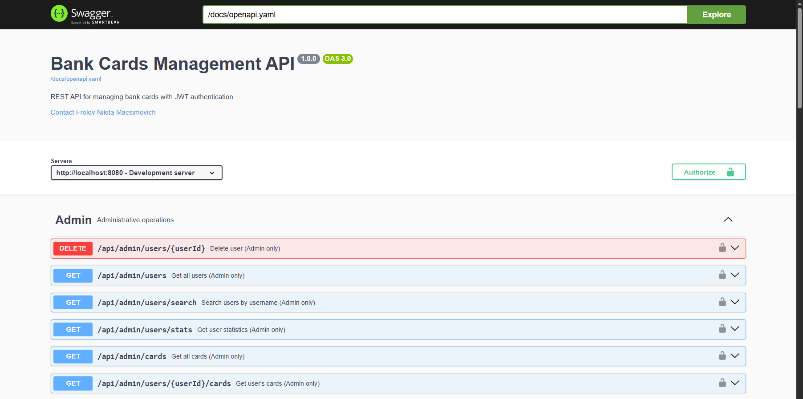

## Перейдем в раздел Authentication -> `POST /api/auth/login`
### Введем данные что показаны на изображении и нажмем кнопку выполнить
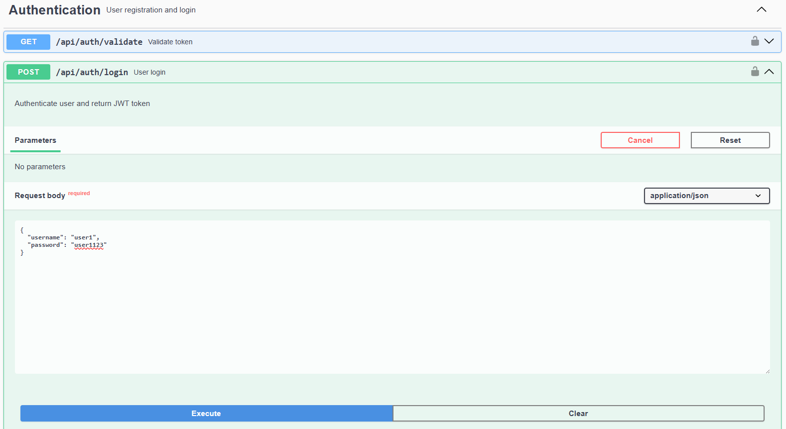

## Нам придет ответ, из него надо скопировать токен
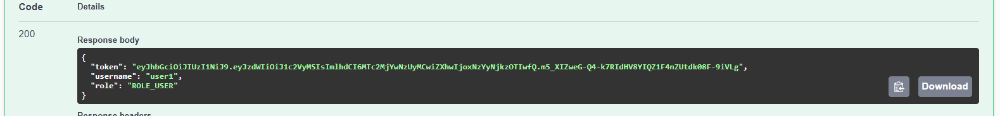

## Далее введем этот токен в форму по кнопке
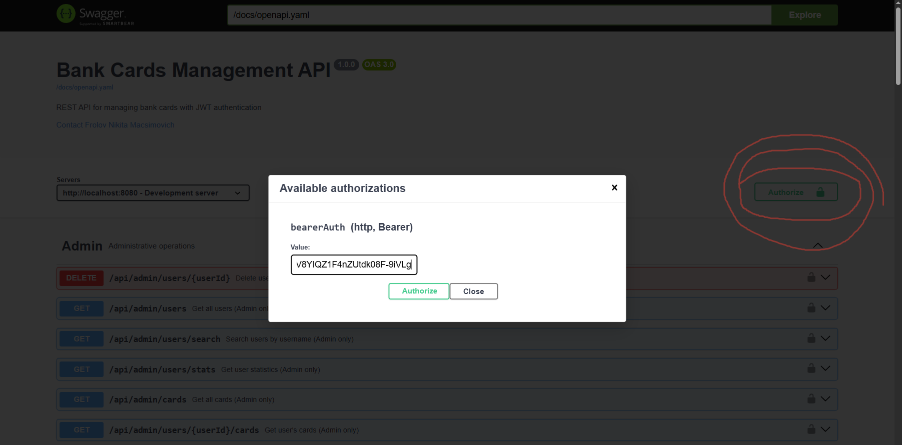

### Теперь мы можем использовать API доступное нам

## Например протестируем получение всех наших карт
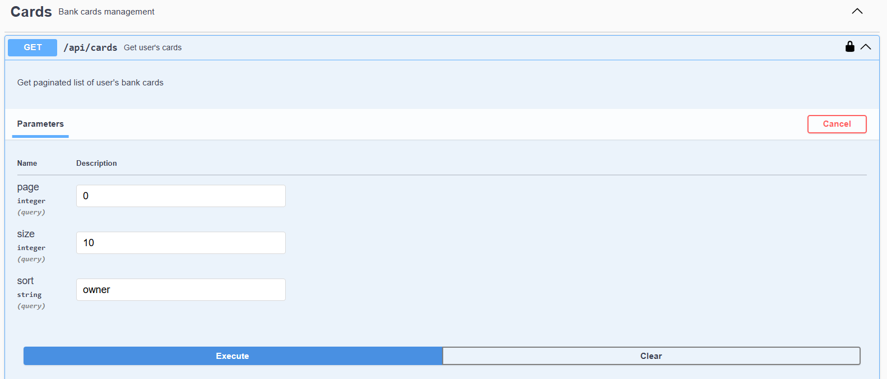
### Ответ
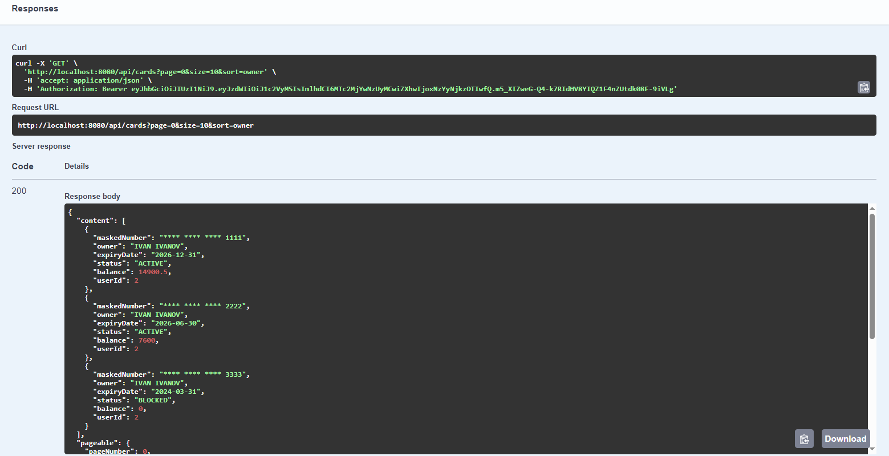
### Мы видим свои карты согласно ТЗ

## Теперь попробуем сделать транзакцию
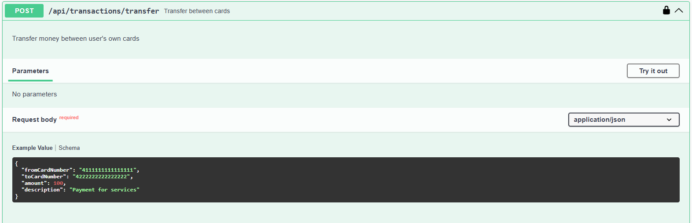
### В ответе получим
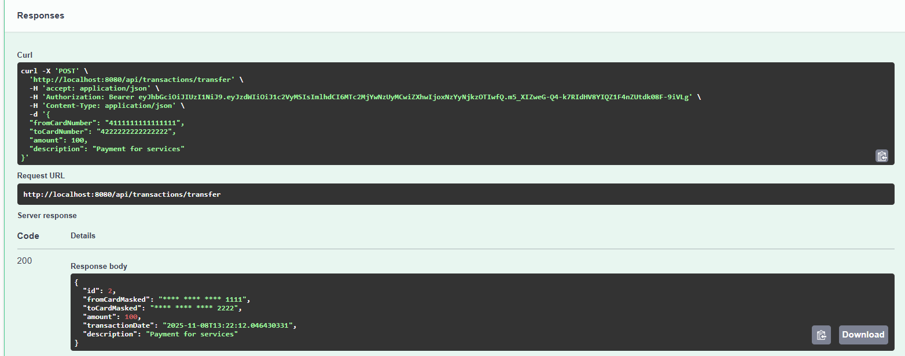

## Теперь перейдем сюда и введем эти данные
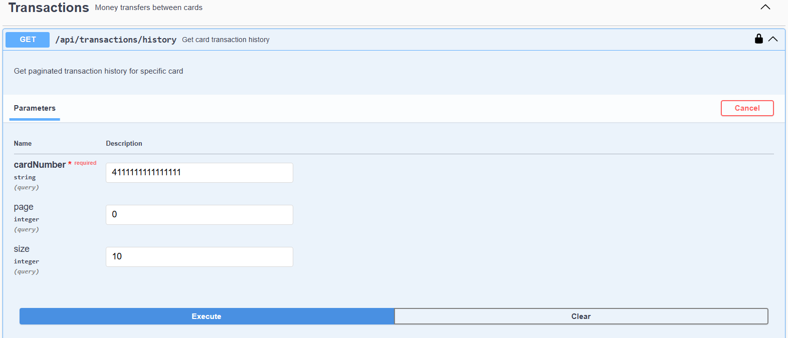
### В ответе получим (у вас будет иначе, т.к. я уже делал эту транзакцию ранее)
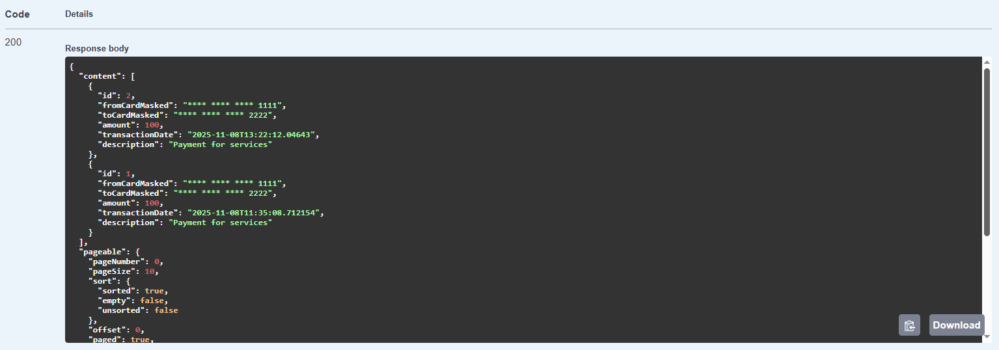

## Можем снова войти сюда и проверить
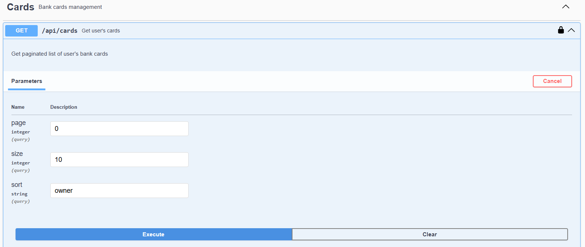
### Можно увидеть разницу на балансах 
